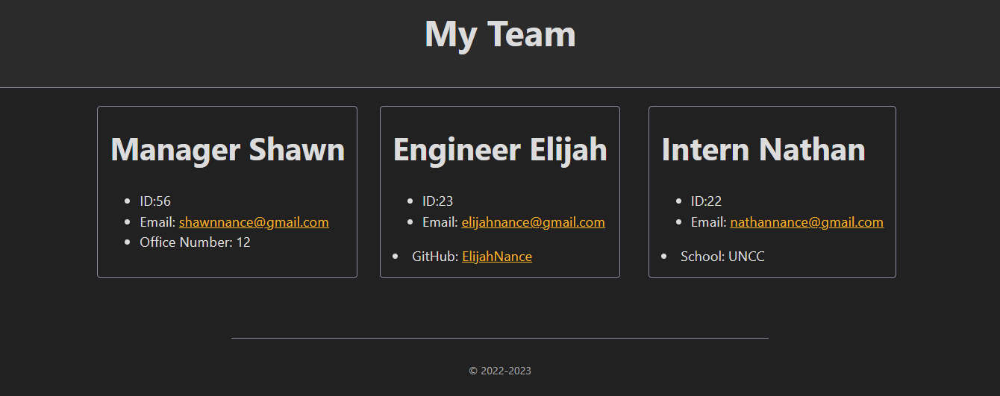

# team-profile-generator

[Video Runthrough Link](https://drive.google.com/file/d/1_c59UxkIDqjCXLXigf3odTZwp_eg_vft/view)

## Description
This is a program that generates an HTML file based on user input using the inquirer package. When the user runs the program, they are asked question for information about the manager of the team. After they have answered the questions they are then prompted to either add an engineer or an intern to the team. If they add an engineer they are asked to add a GitHub username. If they add an Intern then they add which school the intern attends. Once the user has completed their team they have the option to finish the program, which then generates a styled html page with cards that have the employees data.

## Visuals
